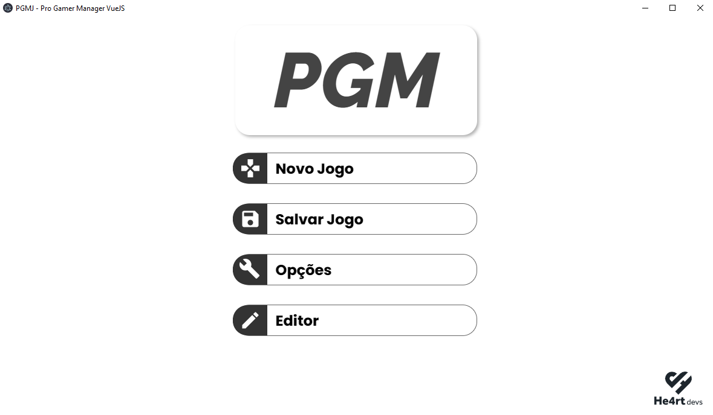

<!-- PROJECT LOGO -->
<br />
<p align="center">
  <a href="https://github.com/Novout/PGMV-Pro-Gamer-Manager-VueJS">
    
  </a>
</p>

### Desenvolvido Com

- [Electron](https://www.electronjs.org/)
- [VueJS](https://vuejs.org/)

<!-- GETTING STARTED -->

## Iniciando

Para fazer uma cópia e rodar o projeto localmente, siga estes passos.

### Instalação

1. Clone o repositorio

```sh
git clone https://github.com/Novout/PGMJ-Pro-Gamer-Manager-VueJS.git
```

2. Instale as dependências

```sh
yarn install
```

<!-- USAGE EXAMPLES -->

## Como Usar

Para iniciar o servidor de desenvolvimento utilize o seguinte comando

```sh
yarn el:serve
```

Para realizar a build do projeto execute o seguinte comando

```sh
yarn el:build
```

## Como Contribuir

1. Realize um Fork do projeto
2. Adicione o conteúdo (`git add -A`)
3. Crie um branch com a nova feature (`git checkout -b feature/featureBraba`)
4. Realize o Commit (`git commit -m 'adicionando conteudo brabo'`)
5. Realize o Push no Branch (`git push origin feature/featureBraba`)
6. Abra um Pull Request

<!-- LICENSE -->

## Licença

Distribuido sobre a licença `MIT`. Leia o arquivo `LICENSE` para mais informações.

<!-- CONTACT -->

## Contato

Giovane Cardoso - [@NovoutT](https://twitter.com/NovoutT) - novout@hotmail.com
